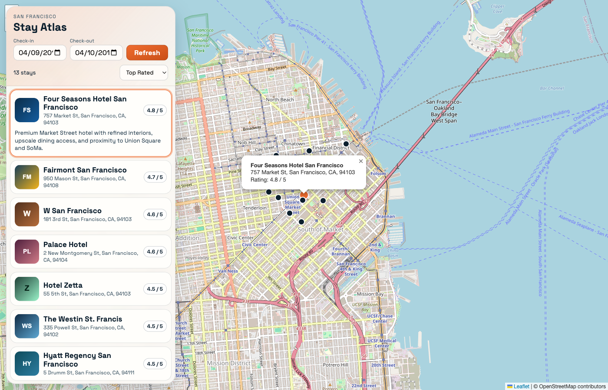

# Go Microservices Example

A small Go microservices demo with:

- HTTP frontend
- gRPC service-to-service communication
- Jaeger distributed tracing

The app renders an interactive map with a hotel list overlay.



## Architecture

Request flow:

1. Browser calls the frontend (`/hotels`).
2. Frontend calls `search` (gRPC).
3. `search` calls `geo` and `rate` (gRPC).
4. Frontend calls `profile` (gRPC) for hotel details.
5. Frontend returns GeoJSON to the browser.

Service data is stored in JSON files under `data/` and embedded via `go-bindata`.

## Prerequisites

- Docker + Docker Compose
- Go 1.19+
- `protoc` (only if regenerating protobuf code)
- `go-bindata` (only if regenerating embedded data)

Install optional tooling:

```bash
go install google.golang.org/protobuf/cmd/protoc-gen-go@latest
go install google.golang.org/grpc/cmd/protoc-gen-go-grpc@latest
go install github.com/go-bindata/go-bindata/...@latest
```

## Run

Start all services:

```bash
make run
```

Open the app:

- [http://localhost:5001/](http://localhost:5001/)

Run without Docker (all services on localhost):

```bash
make run-local
```

Frontend health/readiness:

- [http://localhost:5001/healthz](http://localhost:5001/healthz)
- [http://localhost:5001/readyz](http://localhost:5001/readyz)

Sample API call:

```bash
curl "http://localhost:5001/hotels?inDate=2015-04-09&outDate=2015-04-10"
```

## Tracing

Jaeger UI:

- [http://localhost:16686/search](http://localhost:16686/search)

## Regenerate Artifacts

Regenerate protobuf stubs after editing `internal/services/*/proto/*.proto`:

```bash
make proto
```

Regenerate embedded data after editing `data/*.json`:

```bash
make data
```

## Development Checks

```bash
go test ./...
go build ./...
```

## Credits

Thanks to all [contributors][6].

This codebase was inspired by:

- [Scaling microservices in Go][3]
- [gRPC Example Service][4]
- [go-kit][5]

[3]: https://speakerdeck.com/mattheath/scaling-microservices-in-go-high-load-strategy-2015
[4]: https://github.com/grpc/grpc-go/tree/master/examples/route_guide
[5]: https://github.com/go-kit/kit
[6]: https://github.com/harlow/go-micro-services/graphs/contributors
