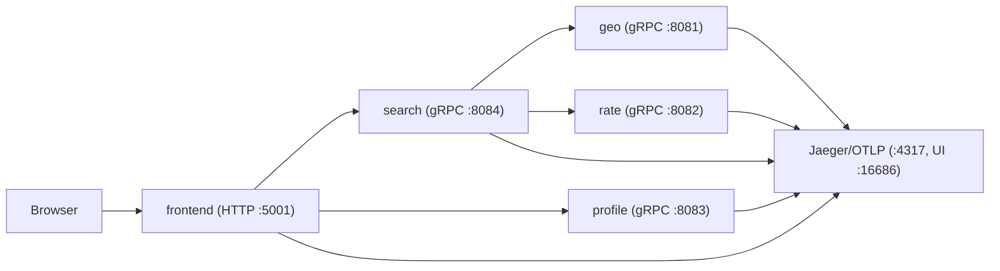

# Go Microservices Example

Small, runnable example of Go microservices with:

- HTTP frontend
- gRPC service-to-service calls
- OpenTelemetry tracing to Jaeger
- Docker and non-Docker local workflows


## What This Repo Demonstrates

- Service boundaries (`frontend`, `search`, `profile`, `geo`, `rate`)
- End-user HTTP API (`/hotels`)
- Internal gRPC composition (`search` fans out to `geo` + `rate`)
- Basic operational surface (`/healthz`, `/readyz`, traces)

## Architecture



## Prerequisites

- Go (version from `go.mod`)
- Docker + Docker Compose (optional, for containerized stack)
- `protoc` + codegen tools (only for regenerating protobuf stubs)
- `go-bindata` (only for regenerating embedded JSON assets)

Install codegen tooling:

```bash
go install google.golang.org/protobuf/cmd/protoc-gen-go@latest
go install google.golang.org/grpc/cmd/protoc-gen-go-grpc@latest
go install github.com/go-bindata/go-bindata/...@latest
```

## Golden Path (Local, No Docker)

1. Start all services:

```bash
make run-local
```

2. Open UI:

- [http://localhost:5001/](http://localhost:5001/)

3. Hit API directly:

```bash
curl "http://localhost:5001/hotels?inDate=2015-04-09&outDate=2015-04-10"
```

4. Check health/readiness:

- [http://localhost:5001/healthz](http://localhost:5001/healthz)
- [http://localhost:5001/readyz](http://localhost:5001/readyz)

5. View traces:

- [http://localhost:16686/search](http://localhost:16686/search)

## Docker Stack

```bash
make run
```

The frontend is available at [http://localhost:5001/](http://localhost:5001/).

## HTTP API Contract

### `GET /hotels`

Required query params:

- `inDate` (`YYYY-MM-DD`)
- `outDate` (`YYYY-MM-DD`, must be after `inDate`, max range 30 days)

Example:

```bash
curl "http://localhost:5001/hotels?inDate=2015-04-09&outDate=2015-04-10"
```

Success response shape:

```json
{
  "type": "FeatureCollection",
  "features": [
    {
      "type": "Feature",
      "id": "hotel-id",
      "properties": {
        "name": "Hotel Name",
        "address_line": "123 Main St, San Francisco, CA, 94105",
        "description": "Hotel description",
        "rating": 4.7,
        "logo_url": "/logos/example.svg"
      },
      "geometry": {
        "type": "Point",
        "coordinates": [-122.4, 37.78]
      }
    }
  ]
}
```

Validation or upstream error shape:

```json
{
  "error": {
    "code": "INVALID_ARGUMENT",
    "message": "invalid inDate format, expected YYYY-MM-DD"
  }
}
```

## Failure Demo

To demonstrate readiness behavior when a dependency is down:

1. Stop `search` (local run: interrupt and restart without search, Docker run: `docker-compose stop search`).
2. Request readiness:

```bash
curl -i http://localhost:5001/readyz
```

Expected: `503 Service Unavailable` with `NOT_READY`.

## Developer Commands

Run all Go checks:

```bash
make check
```

Regenerate protobuf stubs:

```bash
make proto
```

Regenerate embedded data:

```bash
make data
```

Verify generated files are current:

```bash
make check-generated
```
